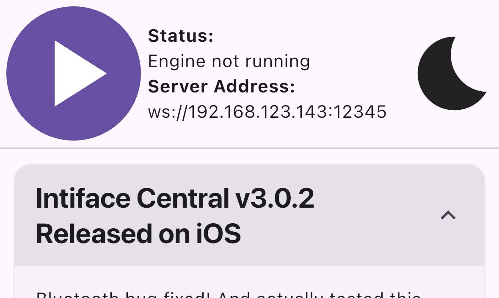

# Lovense

## Should I use a Bluetooth Dongle, Intiface Central Repeater, a Lovense Dongle, or Lovense Connect?

The only answer at this point is Bluetooth Dongle or Your Phone Also Running Intiface Central.

**Intiface Central no longer supports the Lovense Dongle or Lovense Connect App.**

:::warning What happened to Lovense Connect support?

If you'd seen this page in the past, you know that about half of it was dedicated to troubleshooting Lovense Connect. The way we talk to Lovense Connect requires varying between mobile platforms, the whole is undocumented, and it barely ever worked.

Early on in our platform, before we had a mobile app, we supported Lovense Connect as a way for people to get to their devices on their phones. However, this was an exception to our rule of depending on manufacturer's services to access hardware, and it has bitten us several times at this point. We don't have the resources to continue reverse engineering and supporting this, especially when our own app access seems to work much better, even if it is still not the easiest to set up at the moment.

We have Intiface Central on mobile now, and it can do everything Lovense Connect can, though at the moment with a slightly less polished UI flow. We're working on that part, but our support load has exploded on the Connect side in the past couple of months, so it's either spent a ton of time supporting software that's not ours or rip the bandaid off and try to improve.

:::

:::warning What happened to the Lovense Dongle?

Much like Lovense Connect, we were never supposed to be able to access the Lovense Dongle. We reverse engineered it and put in support for it very, very early in the project (around 2018) as many people were still running on desktop machines without bluetooth access, and much like above, we didn't have a mobile app of our own to use as a bluetooth radio. 

That said, we didn't do a particularly good job of reverse engineering it because it was a nightmare of a protocol, and also extremely slow since it's basically a bluetooth proxy chip. We only ever implemented access for one device when it could support 2 but, once again, nightmare for us to reverse at support.

At this point, Windows 10/11 have decent bluetooth support, and anyone who is on a desktop platform we don't directly support can hop through a phone using Intiface Central mobile, so we've decided to drop support.

:::

### Bluetooth Dongle

As with most of our toy support, we recommend using a regular Bluetooth LE Dongle with Lovense toys. The specific dongle we recommend is in the [Bluetooth section of this FAQ](../hardware/bluetooth). Bluetooth Dongles are the most reliable and usually least laggy way to access toys.

While the Lovense website says that the Lovense Dongle is required to use for Lovense Toys on desktops, this is only true for applications made by Lovense. Buttplug can use regular Bluetooth 4/5 dongles to communicate with Lovense toys (mostly) without issues.

### Intiface Central Mobile and/or Repeater Mode

If you don't have a way to access bluetooth on your computer, or can't get it to work, you can also use the Intiface Central mobile app, which is free and available on Google Play Store and Apple App Store. There's two ways you can hook your phone up to games/apps on your desktop with this.

#### Direct Access

If the game/app allows you to change the network address, you can (sometimes) use the IP Address you see in Intiface Central on your phone to connect to toys.

As shown, you can get the IP address and port of your phone to share with the game/app. If your phone was already working with Lovense Connect, this method should most likely work also.

Where you enter this info in the game or app can vary based on the UI. You will need to consult the developer of the software you are trying to use this with to see if this is possible, and if so, how it can be done.

:::tip Nerd Question: Why don't you support some kind of Autodiscovery like mDNS, or use an external signalling server w/ NAT Punching?

HAVE YOU EVER WORKED WITH MDNS.

We're trying, mDNS currently in Intiface Central (hidden behind an experimental/advanced option), but getting it to work across random home networks is a really, truly special kind of nightmare.

As for a signalling server, this is something we're looking at via something like WebRTC or iroh. The last thing I want to do in 2026 is run an online service for matching people to their sex toys, but we may figure out a way to use open public relays or something as well as letting people host their own.

:::

#### Repeater Mode

Repeater mode is for games/apps that run on desktop but don't have a way to access Intiface Central on your phone directly. You can run Intiface Central on your desktop, and have it send/receive commands on Intiface Central on your phone. For more info, [see the Repeater Panel portion of this documentation](../ui/app-modes-repeater-panel.md). 

## I get a "rx endpoint not found" error with Lovense Toys

This can be one of a few things:

- You are trying to connect to a Lovense Toy with both Bluetooth and Lovense Dongle support turned on, and your computer has both available. This will cause Bluetooth and the Lovense Dongle to race each other to connect to devices and can cause errors. We recommend either unselecting the "Lovense HID/Serial Dongle" support in Intiface Desktop, or else unplugging the Lovense Dongle completely.
- You are using a Bluetooth 5.0 dongle on Windows 10. Windows 10 unfortunately has really bad default drivers for Bluetooth 5.0 at the moment, which causes a lot of issues, including this "rx endpoint not found" issue. [We recommend using a Bluetooth 4.0 dongle like the one linked here.](../hardware/bluetooth)
- You have paired your Lovense toy using the operating system bluetooth dialog (this usually happens on Windows). Make sure the toy is not paired to the operating system, Buttplug/Intiface will handle finding and connecting to the toy without it being paired.

## I renamed my Lovense Toy in the Lovense app and now Intiface Central can't find it

Intiface Central currently expects Lovense devices to have their default bluetooth name when connecting. This name started with "LVS-" then is usually some assortment of letters/numbers. The Lovense App allows users to change this, which at the moment causes Intiface Central to ignore the device.

We hope in a future update to fix this situation and change how we detect Lovense devices. Until then, to reset your device name:

- Open the Lovense Remote App on your phone
- Go to the Toys Tab
- Choose "Pick your toy"
- Go to Settings of the toy that you want to reset
- Choose "Toy name"
- Choose "Leave blank"
- Hit "save"

## I'm a nerd that wants to know about the Lovense Dongle even though you don't support it anymore

The Lovense Dongle is just a Nordic nrf52840 acting as a BLE to UART or HID bridge, depending on which version of the dongle you have. Older Lovense Dongles (earlier than 2018 or so) have a black circuit board which can be seen under the USB connector side, and work as a BLE to UART/Serial converter. Newer Lovense Dongles have a white circuit board and work as a BLE to HID converter.

Due to these dongles relaying over 2 communication mediums and having to run through an extra ARM processor to translate commands, they tend to be slower than just hooking up a regular old Bluetooth LE radio to your computer. This is why they seem laggy. Also, due to the firmware on the nrf52840, only 2 toys can be connected to a Lovense dongle simultaneously (and for Buttplug, we  only supported 1 toy).

The reason that Lovense put the dongle out is that both Serial and HID are handled by operating systems in fairly standard ways, meaning the same code for the dongle will work on Win 7/8.1/10/11. Using actual LE Bluetooth on Windows means only having support for certain (but not all) versions of Windows 10 (MS never backported bluetooth to Win 7/8.1, and both OSes are now well past EOL support), and all versions of Windows 11. Since Lovense's user base is far larger than that of Buttplug's, and with far more variation in user hardware and experience, this ended up working best for their engineering and support.

But if you're the kind of nerd that reads this whole section and understood it, just use fucking Bluetooth, ok?

## I'm possibly the same nerd that read the last question and also want to know how Lovense Connect works

First off, how Lovense Connect works: Lovense Connect hosts two types of services off its mobile app: HTTP and Websockets. Whenever a Lovense Connect app is queried, it will hand back 4 ports to connect to: HTTP, HTTPS, WS, and WSS. For simplicity sake, Buttplug will always use HTTP. Once connected, apps talk a special JSON based protocol over whichever port was chosen.

Lovense Connect uses a very weird setup for what is basically NAT punching, since robust local discovery still isn't a thing in the year of our lord 2026. When a phone starts the Lovense Connect app, it registers itself with Lovense's servers. Other systems on the same network _should_ be able to see the phone via the [Lovense API endpoint](https://api.lovense.com/api/lan/getToys) mentioned above. However, ONLY systems that Lovense thinks are on the same network can see this. Lovense handles this by basically trying to guess whether queries are coming from the same IP. This is why IPv6 won't work, because Lovense can't reason correctly about NAT for that.

Issues with Lovense Connect not working usually involve:

- Wifi and Wired networks being on different subnets
- Wifi and Wired networks being misconfigured internally

So those are two things to check.

Note that this next part *should* be bypassed by Buttplug, but it's good to know just in case:

DNS issues usually arise because Lovense does some EXTREMELY sketchy shit with domains and certificates. As the Lovense Connect API needs to be usable from web browsers (so people can build webpages that control toys through Lovense Connect), and possibly from HTTPS sites in web browsers, Lovense Connect has to host a secure site on the user's phone. To do this, Lovense uses the local lovense.club domain. The Lovense Connect app is distributed with a private certificate wildcarded for the lovense.club domain, and local IPs are bounced through the domain's DNS. So for instance, if your desktop is 192.168.1.2 and your mobile phone is 192.168.1.3, querying the API endpoint will tell your desktop to connect to 192-168-1-3.lovense.club. Your desktop can then make an HTTPS request to 192-168-1-3.lovense.club, which then routes to your phone, but your phone will return the wildcarded lovense.club cert.

Buttplug got around this by only using HTTP (since we're not really planning on doing this from a browser) and parsing the IP out of the lovense.club URL handed to us by the Buttplug API. Therefore, DNS *shouldn't* be an issue, but there's always the chance we missed something.

But who cares, we've kicked it out of the library and it's not our problem anymore.