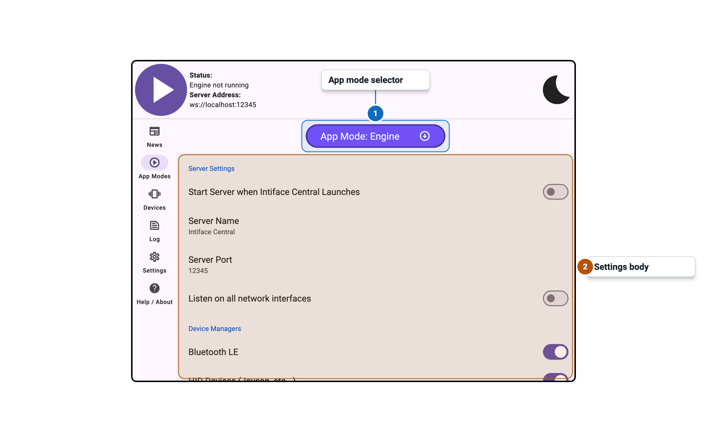
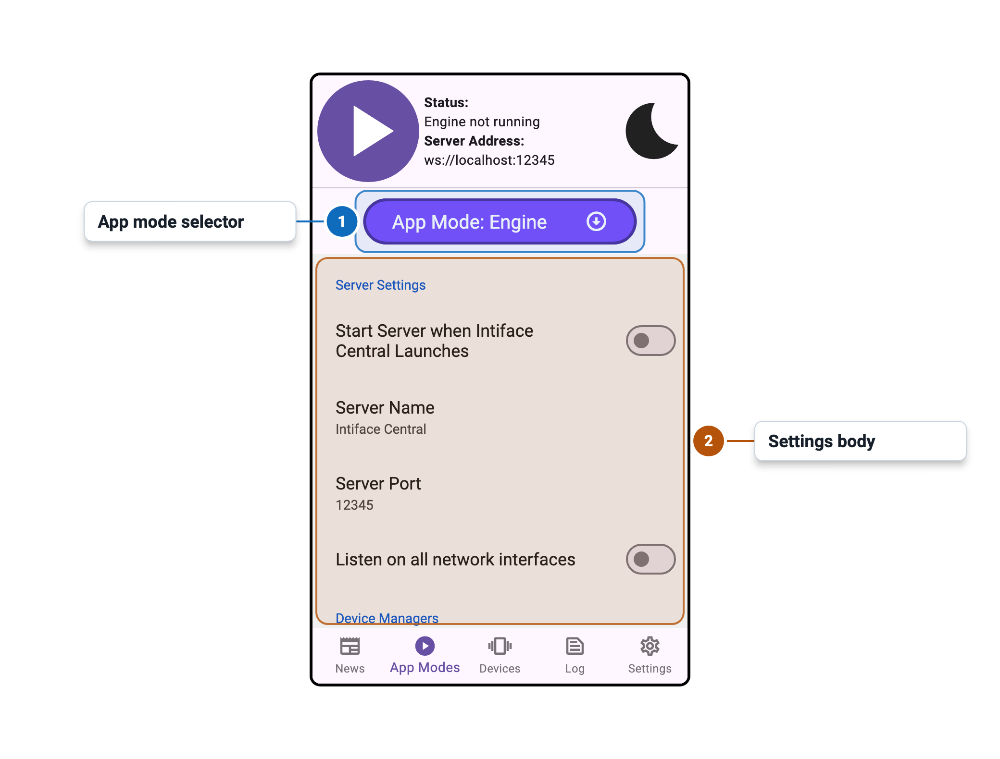

import Tabs from '@theme/Tabs';
import TabItem from '@theme/TabItem';

# App Modes Tab - Engine Control Panel

<Tabs>
  <TabItem value="desktop" label="Desktop" default>
    
  </TabItem>
  <TabItem value="mobile" label="Mobile">
    
  </TabItem>
</Tabs>

## Settings

### Server Settings

| Setting | Control | Default | Availability / notes |
|---|---:|---:|---|
| Start Server when Intiface Central Launches | Toggle | Off | Disabled while engine is running |
| Server Name | Text entry | `Intiface Server` | Disabled while engine is running |
| Server Port | Numeric entry | `12345` | Disabled while engine is running; valid range `1025`-`65535` |
| Listen on all network interfaces | Toggle | On mobile, off elsewhere | Disabled while engine is running |

### Device Managers

| Setting | Control | Default | Availability / notes |
|---|---:|---:|---|
| Bluetooth LE | Toggle | On | Disabled while engine is running |
| XBox Compatible Gamepads (XInput) | Toggle | On on Windows | Windows only; disabled while engine is running |
| HID Devices (Joycon, etc...) | Toggle | Off | Desktop only; disabled while engine is running |
| Lovense Connect Service (DEPRECATED) | Toggle | Off | Desktop only; shows deprecation dialog when enabled |
| Lovense USB Dongle (HID/White Circuit Board) (DEPRECATED) | Toggle | Off | Desktop only; shows deprecation dialog when enabled |
| Other Device Managers are in Advanced Settings Below | Info row | N/A | Visible hint, not configurable |

### Advanced/Experimental Settings

| Setting | Control | Default | Availability / notes |
|---|---:|---:|---|
| Show Advanced/Experimental Settings | Toggle | Collapsed unless previously expanded | Controls visibility of advanced rows |
| Broadcast Server Info via mDNS | Toggle | Off | Advanced only; disabled while engine is running |
| mDNS Identifier Suffix (Optional) | Text entry | Empty | Advanced only; disabled while engine is running |

### Advanced Device Managers

| Setting | Control | Default | Availability / notes |
|---|---:|---:|---|
| Device Websocket Server | Toggle | Off | Advanced only; disabled while engine is running |
| Simulated Devices | Toggle | Off | Advanced only; disabled while engine is running |
| Lovense USB Dongle (Serial/Black Circuit Board) (DEPRECATED) | Toggle | Off | Advanced, non-mobile only; shows deprecation dialog when enabled |
| Serial Port | Toggle | Off | Advanced, non-mobile only; disabled while engine is running |
