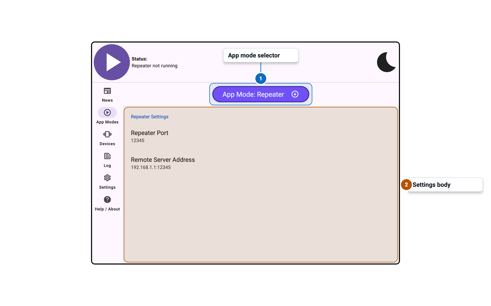
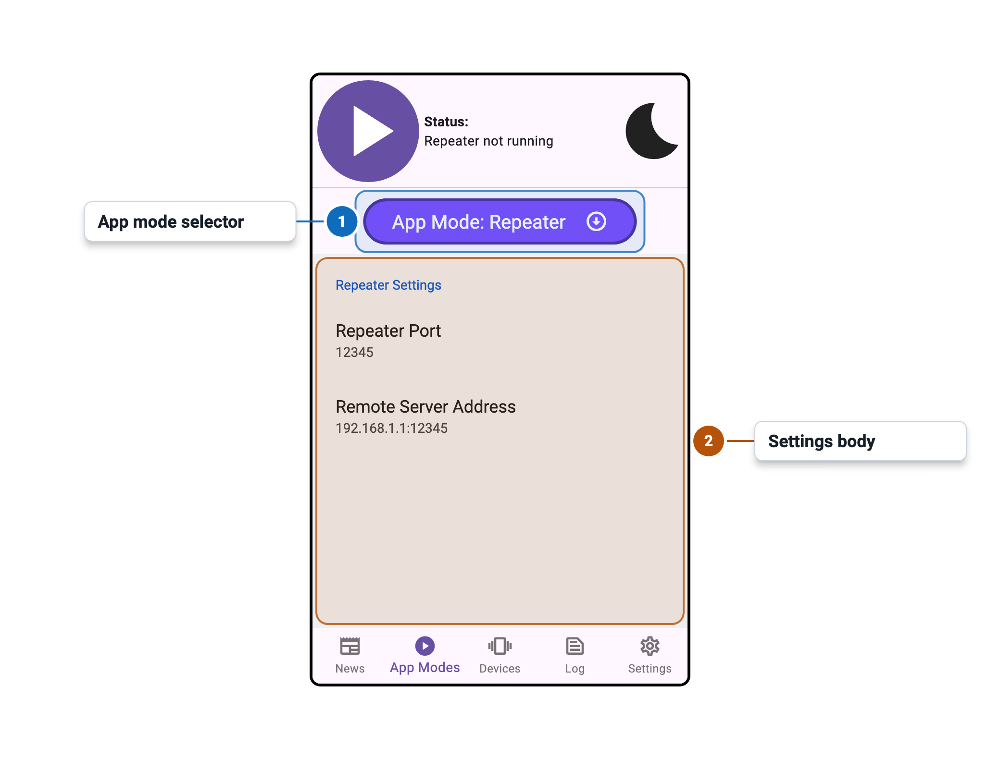

import Tabs from '@theme/Tabs';
import TabItem from '@theme/TabItem';

# App Modes - Repeater Panel

<Tabs>
  <TabItem value="desktop" label="Desktop" default>
    
  </TabItem>
  <TabItem value="mobile" label="Mobile">
    
  </TabItem>
</Tabs>

## Overview

Full instructions will be added soon, but for now, here's a quick overview of how Repeater Mode works.
- Start Intiface Central on your phone
- Start the server on your phone
- On desktop, change mode to "Repeater"
- For the repeater address, put in your phone IP address as shown in Intiface Central. 
  - If you are using Intiface Central v2.6.0 or earlier, MAKE SURE TO ADD ws:// at the front otherwise the app will crash. This will be fixed in v2.6.1 at later versions.
- Start repeater on Intiface Central desktop
- For the app you are trying to use on desktop, connect to 127.0.0.1:12345 as normal
- The connection should then forward to your phone

## Settings

| Setting | Control | Default | Availability / notes |
|---|---:|---:|---|
| Repeater Port | Numeric entry | `12345` | Disabled while engine is running; valid range `1025`-`65535` |
| Remote Server Address | Text entry | `192.168.1.1:12345` | Disabled while engine is running |
