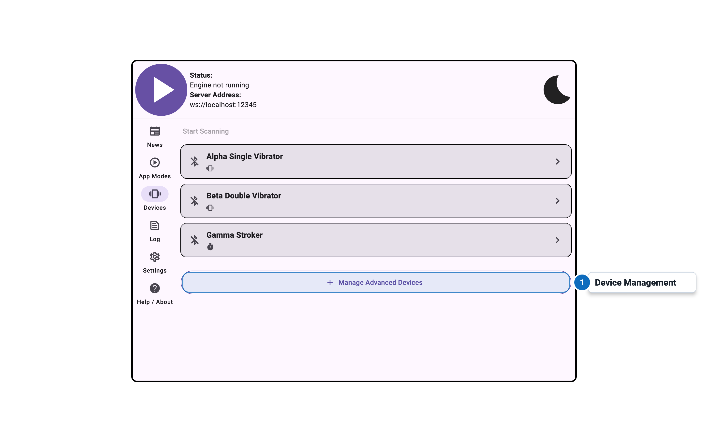
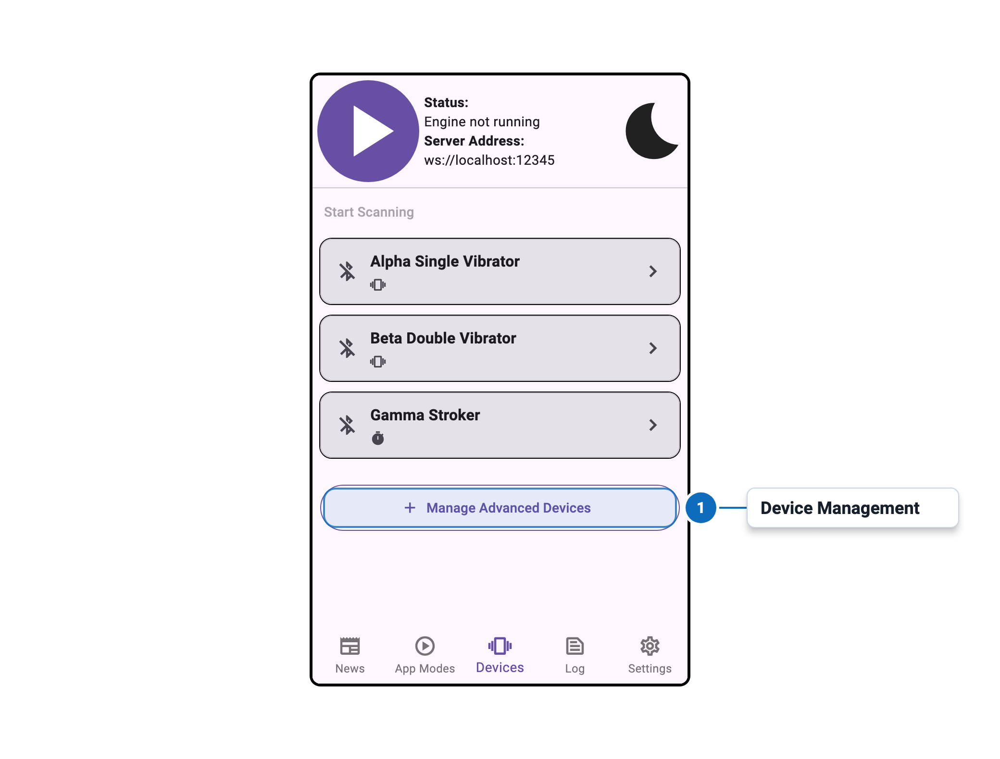

import Tabs from '@theme/Tabs';
import TabItem from '@theme/TabItem';

# Advanced Device Entry

<Tabs>
  <TabItem value="desktop" label="Desktop" default>
    
  </TabItem>
  <TabItem value="mobile" label="Mobile">
    
  </TabItem>
</Tabs>

## Overview

The Advanced Device Entry panel shows the detailed configuration and status for an individual device
in the advanced device manager. This panel is accessible by tapping the arrow icon on a device in
the Advanced Device Management list.

## Settings

Documentation for this panel will be added soon.
