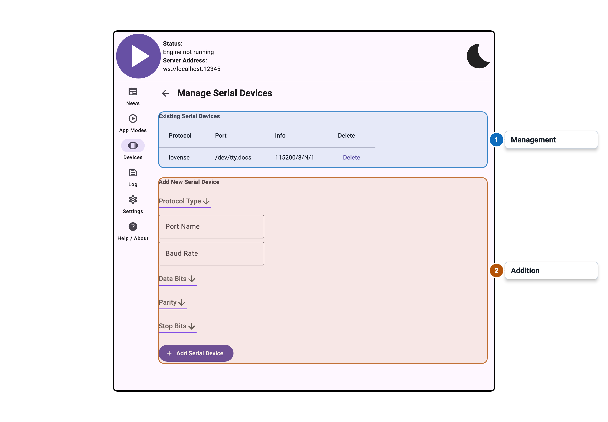

import Tabs from '@theme/Tabs';
import TabItem from '@theme/TabItem';

# Serial Device Management

:::note Desktop Only
Serial port device management is only available on desktop platforms (Windows, macOS, Linux).
:::

## Overview

The Serial Device Management panel configures devices that connect via serial port. Serial port
support is an advanced feature intended for users with hardware that communicates over RS-232 or
USB-to-serial adapters.

To enable serial port support, turn on **Serial Port** under Advanced Device Managers in the App
Modes settings tab.

## Settings

Documentation for this panel will be added soon.
