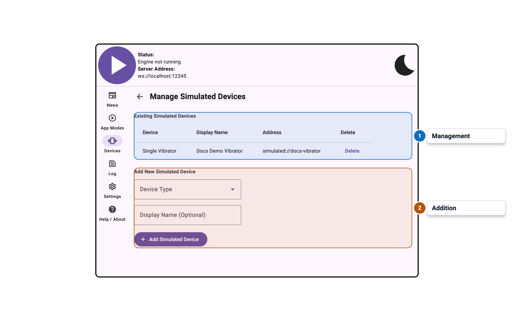
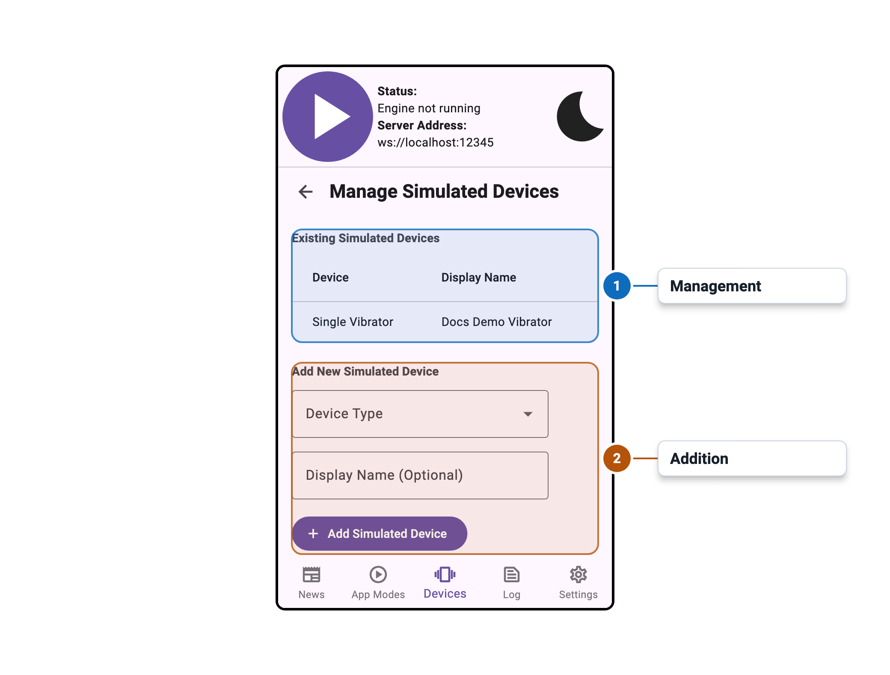

import Tabs from '@theme/Tabs';
import TabItem from '@theme/TabItem';

# Simulated Device Management

<Tabs>
  <TabItem value="desktop" label="Desktop" default>
    
  </TabItem>
  <TabItem value="mobile" label="Mobile">
    
  </TabItem>
</Tabs>

## Overview

The Simulated Device Management panel allows you to add virtual devices for testing purposes.
Simulated devices behave like real hardware devices but do not require any physical hardware.

This is useful for developers who want to test applications that use Intiface Central without
needing to connect real devices.

## Settings

Documentation for this panel will be added soon.
