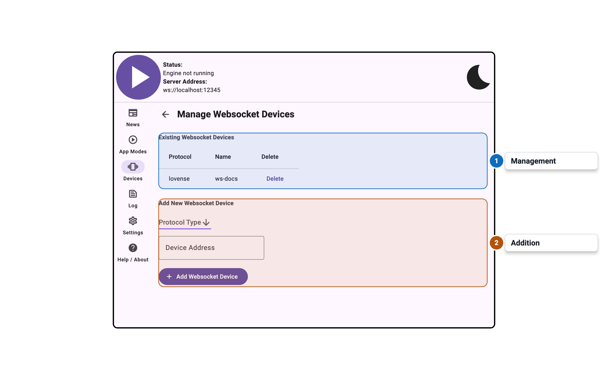
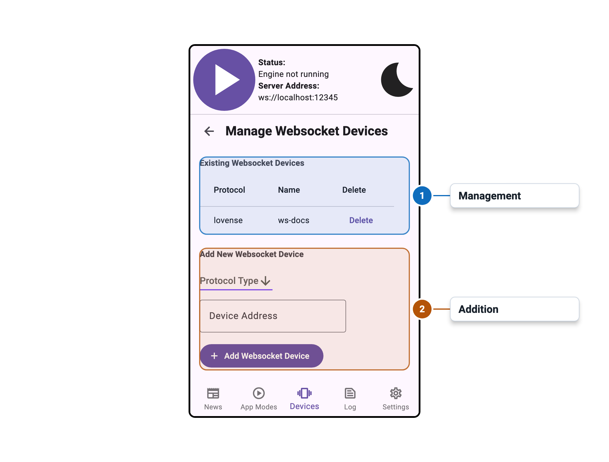

import Tabs from '@theme/Tabs';
import TabItem from '@theme/TabItem';

# WebSocket Device Management

<Tabs>
  <TabItem value="desktop" label="Desktop" default>
    
  </TabItem>
  <TabItem value="mobile" label="Mobile">
    
  </TabItem>
</Tabs>

## Overview

The WebSocket Device Management panel configures the Device WebSocket Server, which allows
external devices or applications to connect to Intiface Central as if they were hardware devices.

This is an advanced feature intended for developers building custom device integrations.

## Settings

Documentation for this panel will be added soon.
