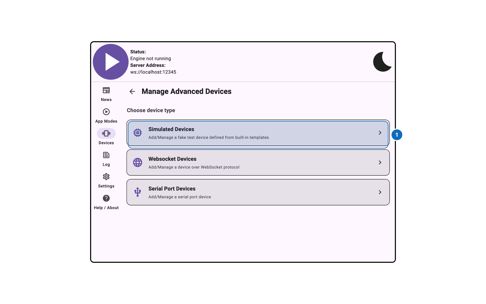
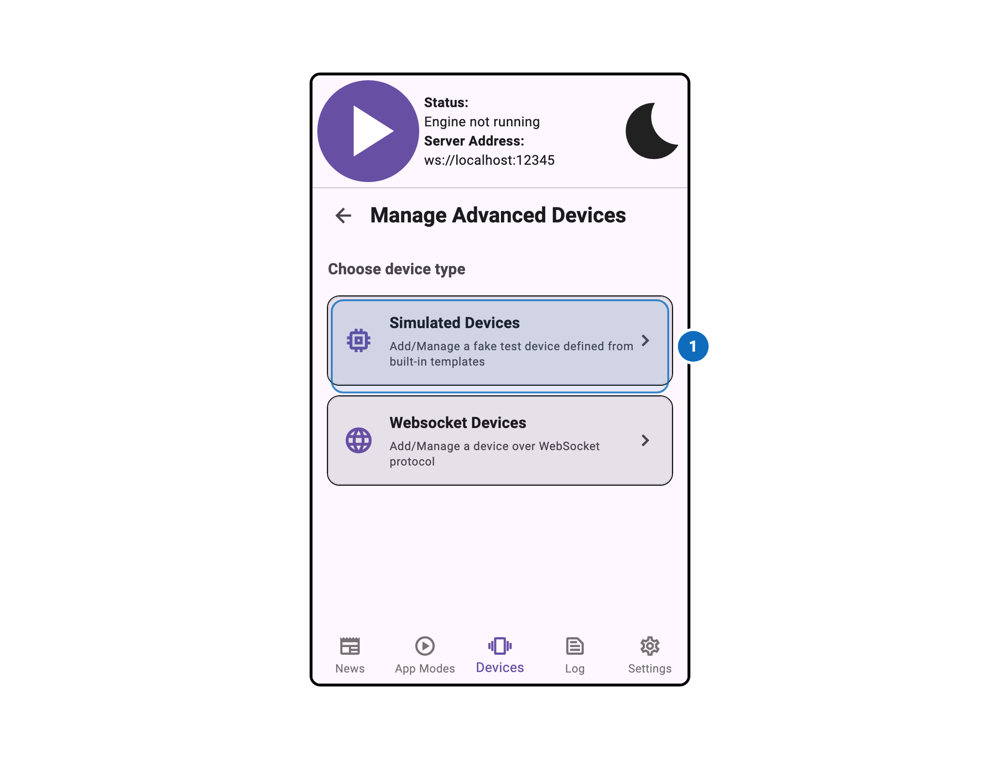

import Tabs from '@theme/Tabs';
import TabItem from '@theme/TabItem';

# Advanced Device Management

<Tabs>
  <TabItem value="desktop" label="Desktop" default>
    
  </TabItem>
  <TabItem value="mobile" label="Mobile">
    
  </TabItem>
</Tabs>

## Overview

The Advanced Device Management window provides access to device managers that are not shown in the
main settings panel. These device managers are hidden by default because they require additional
configuration or are intended for advanced users.

To access this panel, enable **Show Advanced/Experimental Settings** in the App Modes tab, then
enable the advanced device manager you want to configure.

## Advanced Device Managers

The following device managers are available in the Advanced Device Management panel:

- **Device WebSocket Server** — Allows external devices to connect via WebSocket
- **Simulated Devices** — Enables simulated/virtual devices for testing
- **Serial Port** — Enables devices connected via serial port (desktop only)
