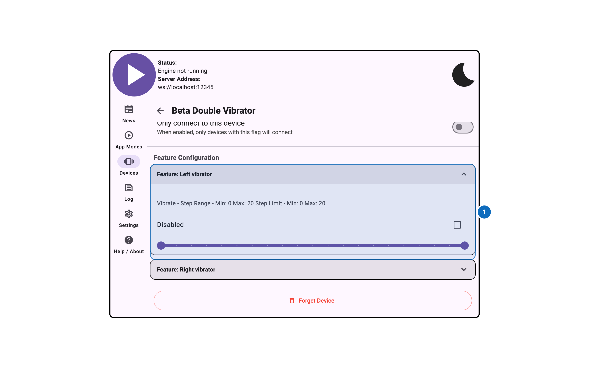
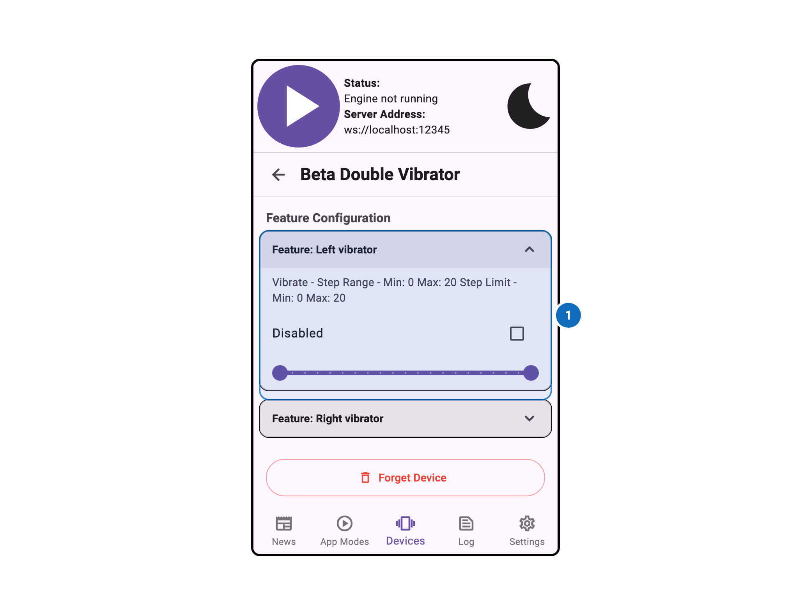

import Tabs from '@theme/Tabs';
import TabItem from '@theme/TabItem';

# Feature Configuration

<Tabs>
  <TabItem value="desktop" label="Desktop" default>
    
  </TabItem>
  <TabItem value="mobile" label="Mobile">
    
  </TabItem>
</Tabs>

## Overview

The Device Feature Configuration panel allows per-feature configuration for a connected device.
Individual actuators and sensors can be renamed, scaled, or otherwise adjusted from this panel.

## Settings

Documentation for this panel will be added soon.
