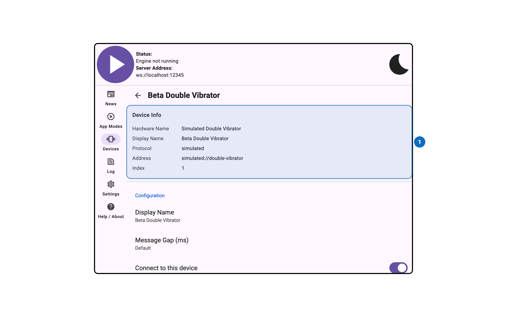
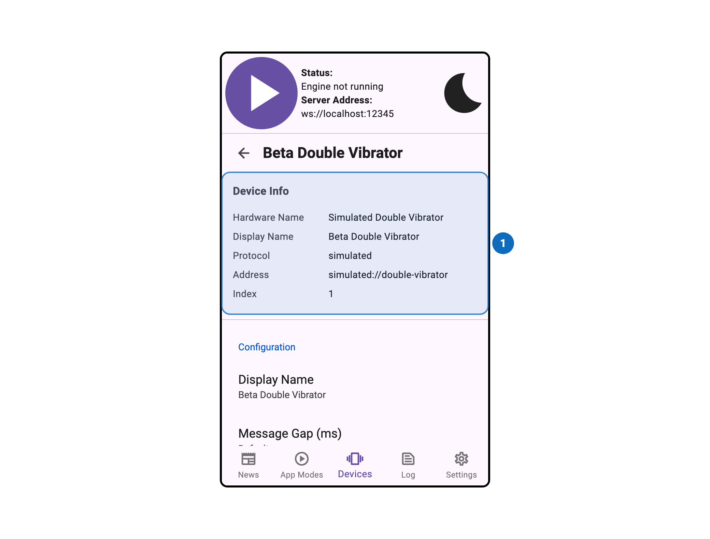

import Tabs from '@theme/Tabs';
import TabItem from '@theme/TabItem';

# Device Info

<Tabs>
  <TabItem value="desktop" label="Desktop" default>
    
  </TabItem>
  <TabItem value="mobile" label="Mobile">
    
  </TabItem>
</Tabs>

## Overview

The Device Info panel shows identifying information about a connected device, including its name,
manufacturer, and protocol details. This is useful for confirming exactly which device is
connected and for reporting device issues.

## Settings

Documentation for this panel will be added soon.
