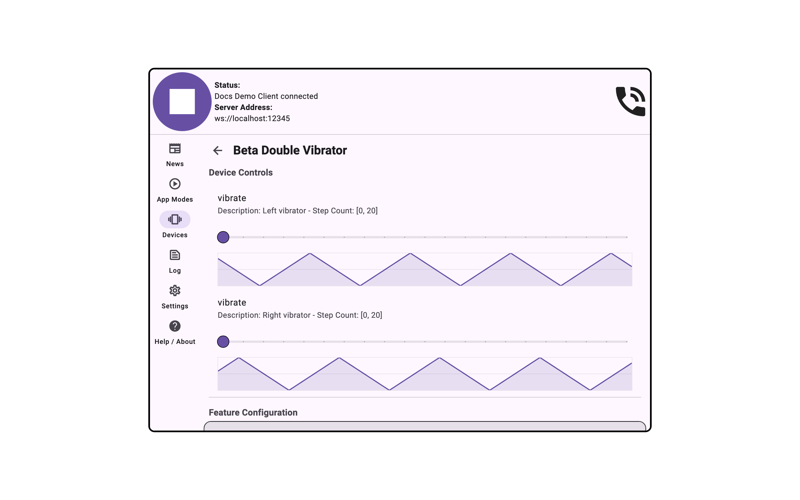
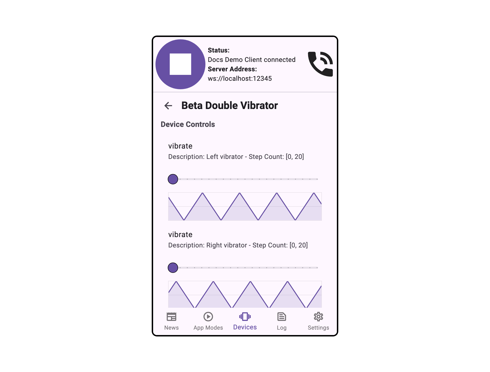

import Tabs from '@theme/Tabs';
import TabItem from '@theme/TabItem';

# Feature Observability

<Tabs>
  <TabItem value="desktop" label="Desktop" default>
    
  </TabItem>
  <TabItem value="mobile" label="Mobile">
    
  </TabItem>
</Tabs>

## Overview

The Device Observability panel provides real-time visibility into the commands being sent to a
device and the sensor readings coming back from it. This is useful for debugging device behaviour
or verifying that an application is communicating with a device correctly.

## Settings

Documentation for this panel will be added soon.
