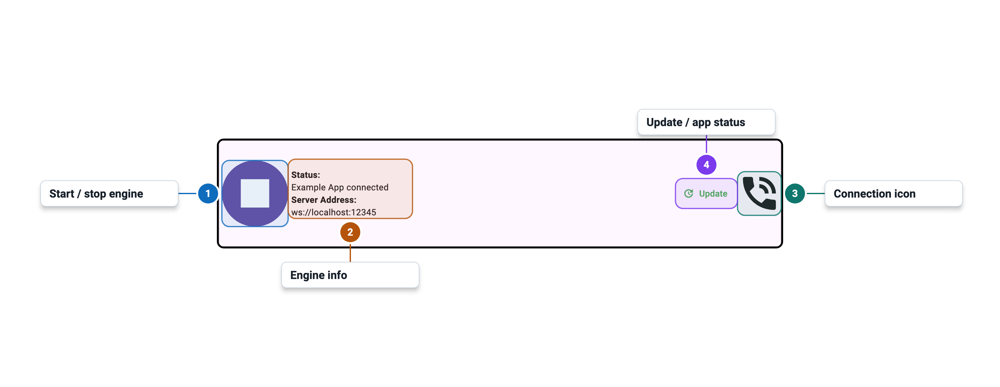

import Tabs from '@theme/Tabs';
import TabItem from '@theme/TabItem';

# Engine Control Panel

The Engine Control Panel is always visible at the top of the app, regardless of which tab is
active. It lets you start and stop the server and shows live status information.

## Icons

### Control Button

| Icon | Flutter icon | Ligature text | Meaning |
|---|---|---|---|
| play_arrow | `Icons.play_arrow` | `play_arrow` | Start server |
| stop | `Icons.stop` | `stop` | Stop server |
| error | `Icons.error` | `error` | Engine file not found — run Check For Updates |

### Connection Status

| Icon | Flutter icon | Ligature text | Meaning |
|---|---|---|---|
| phone_in_talk | `Icons.phone_in_talk` | `phone_in_talk` | Client connected |
| phone_disabled | `Icons.phone_disabled` | `phone_disabled` | Server running, no client connected |
| bedtime | `Icons.bedtime` | `bedtime` | Server not running, or server started and awaiting connection |
| start | `Icons.start` | `start` | Server starting |
| question_mark | `Icons.question_mark` | `question_mark` | Status unknown |

### Alert Buttons

Alert buttons appear in the top-right area of the control panel when relevant. They are hidden
when no alert is active.

| Icon | Flutter icon | Ligature text | Meaning |
|---|---|---|---|
| warning | `Icons.warning` | `warning` | An error occurred — tap to view the log |
| update | `Icons.update` | `update` | App update available — tap to go to Settings |
