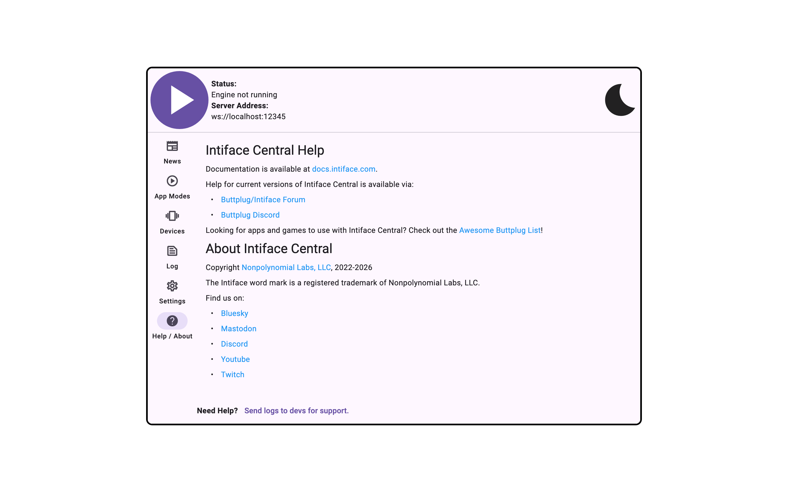
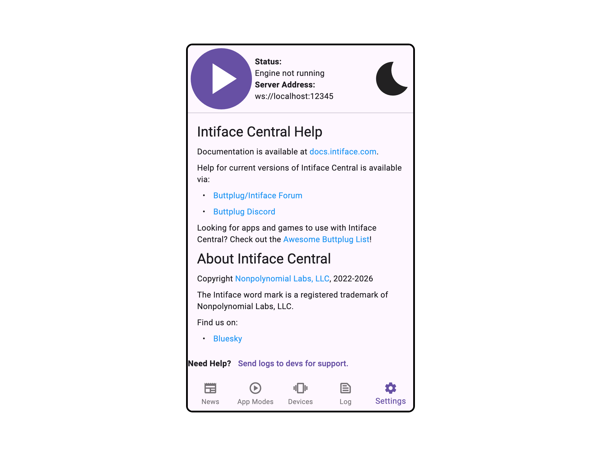

import Tabs from '@theme/Tabs';
import TabItem from '@theme/TabItem';

# News, About, Help Panels

<Tabs>
  <TabItem value="desktop" label="Desktop" default>
    
  </TabItem>
  <TabItem value="mobile" label="Mobile">
    
  </TabItem>
</Tabs>

## Overview

Documentation for this panel will be added soon.
