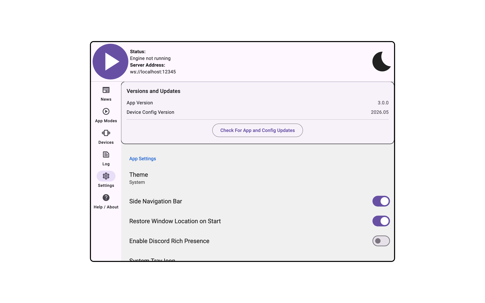
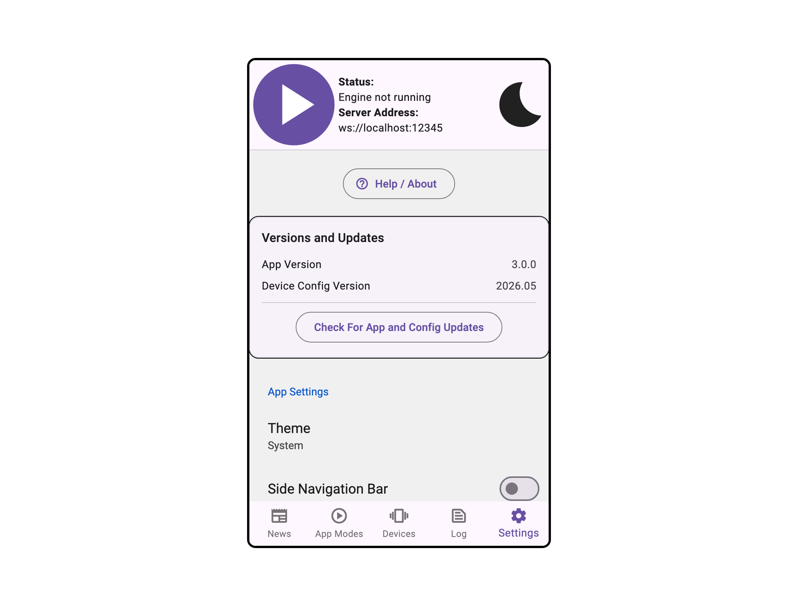

import Tabs from '@theme/Tabs';
import TabItem from '@theme/TabItem';

# Settings Panel

<Tabs>
  <TabItem value="desktop" label="Desktop" default>
    
  </TabItem>
  <TabItem value="mobile" label="Mobile">
    
  </TabItem>
</Tabs>

## Settings Panel

### Help / About

| Setting | Control | Default | Availability / notes |
|---|---:|---:|---|
| Help / About | Button | N/A | Shown in Settings when the side navigation bar is disabled |

### Versions and Updates

| Setting | Control | Default | Availability / notes |
|---|---:|---:|---|
| App Version | Info row | Current app version | Shows the running Intiface Central version |
| Device Config Version | Info row | Current device config version | Shows the active device config version |
| Desktop update available | Link | N/A | Desktop only; shown when visible updates are enabled and a newer app version is available |
| Manual downloads site | Link | N/A | Windows only; shown with the desktop update link |
| Check For App and Config Updates | Button | N/A | Desktop only; disabled while engine is running |
| Check for Config Updates | Button | N/A | Mobile only; disabled while engine is running |

### App Settings

| Setting | Control | Default | Availability / notes |
|---|---:|---:|---|
| Theme | Selector | System | Options are System, Light, and Dark |
| Side Navigation Bar | Toggle | On desktop, off mobile | Controls whether navigation appears as a side rail |
| Restore Window Location on Start | Toggle | On | Desktop only |
| Enable Discord Rich Presence | Toggle | Off | Desktop only |
| System Tray Icon | Selector | Tray + Taskbar | macOS and Windows only; options are No Tray Icon, Tray + Taskbar, and Tray Only |
| Check For Updates when Intiface Central Launches | Toggle | On | Checks for updates on startup |
| Crash Reporting | Toggle | Off | Disabled when crash reporting is not configured in the build |
| Send Logs to Developers | Navigation action | N/A | Opens the send-logs workflow |

### Experimental Features

| Setting | Control | Default | Availability / notes |
|---|---:|---:|---|
| REST Server | Toggle | Off | Enables the experimental REST server app mode |
| Use Prerelease (Beta) Version | Toggle | Off | Desktop only |

### Reset Application

| Setting | Control | Default | Availability / notes |
|---|---:|---:|---|
| Reset User Device Configuration | Action | N/A | Disabled while engine is running; deletes per-device user configuration |
| Reset Application Configuration | Action | N/A | Disabled while engine is running; deletes app configuration, downloaded engine/config files, news, and user device configuration |

### Advanced Mobile Settings

| Setting | Control | Default | Availability / notes |
|---|---:|---:|---|
| Use Foreground Process | Toggle | On | Android and iOS only; disabled while engine is running; changing this requires app restart |
| Request Bluetooth Permissions | Action | N/A | Android and iOS only; opens OS permission request flow and app settings if permissions are permanently denied |
